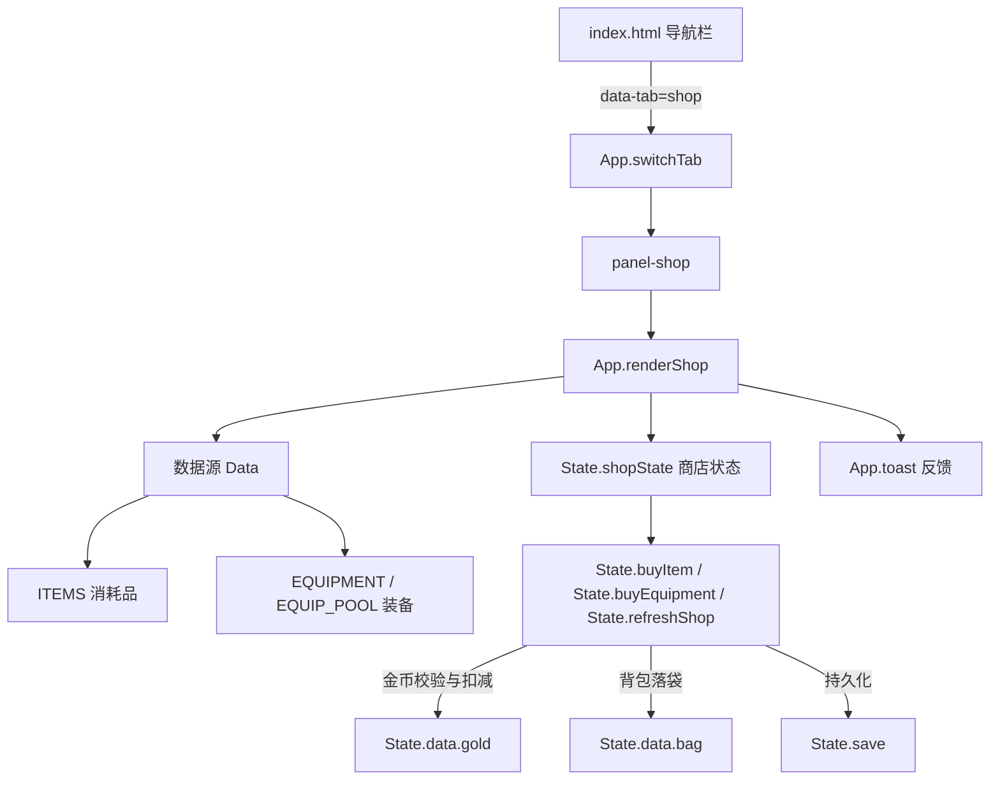

# 商店系统

Feature Name: shop
Updated: 2026-08-07

## Description

为「世界OL」新增商店系统，作为玩家打怪掉落金币的主要消费出口。商店提供两类商品：

1. **消耗品区（固定）**：小血瓶、大血瓶、魔法药水，支持 x1 / x5 / x10 批量购买，价格取自 `Data.ITEMS` 中已定义的 `price` 字段。
2. **装备区（固定 + 随机刷新）**：固定展示一组基础装备商品；提供「刷新」按钮，消耗金币后按玩家等级重新生成随机品质的装备商品。

商店入口加入主界面主导航栏，与「副本 / 背包 / 技能 / 角色」并列。所有购买与刷新操作走统一的金币校验与背包落袋流程，并持久化到本地存档。

## Architecture



架构说明：商店为纯前端功能，不引入后端。新增逻辑集中在 `State`（业务规则）与 `App`（渲染与交互），数据定义复用现有 `Data` 层，避免重复定义价格与属性。

## Components and Interfaces

### 1. HTML 面板 `index.html`

- 在主导航 `<nav class="main-nav">` 新增按钮：`<button class="nav-btn" data-tab="shop">商店</button>`。
- 新增 `<section id="panel-shop" class="panel hidden">`，内部结构：
  - 头部金币显示区（复用 `.gold-text` 样式）。
  - 消耗品区容器 `#shop-consumables`。
  - 装备区容器 `#shop-equipment`，含刷新按钮 `#shop-refresh` 与刷新费用显示。

### 2. 状态层 `js/state.js`

**`State.shopState`**：运行时商店状态（不持久化），用于记忆当前刷新批次，避免重复刷新。结构：

```js
State.shopState = {
  stock: [],          // 当前刷新的装备商品实例数组（含品质与属性）
  refreshPrice: 50,   // 当前刷新费用
  refreshed: false,   // 是否已执行过刷新（首次免费，后续收费）
}
```

**`State.refreshShopStock()`**：按玩家当前等级生成 3 件随机装备商品。

- 计算等级对应 tier：`Math.min(5, Math.max(1, Math.ceil(level / 4)))`，将等级映射到 1-5 的 tier。
- 从 `Data.EQUIP_POOL[tier]` 随机抽取模板 id，调用 `Data.makeItem(tplId)` 生成随机品质实例（内部调用 `Data.rollQuality`）。
- 将 `stock` 置为该批次，返回刷新费用。

**`State.buyItem(itemId, quantity)`**：购买消耗品。

- 依据 `Data.ITEMS[itemId].price` 计算总价。
- 校验金币充足与背包剩余空间（上限 40，见 `State.addItem`）。
- 扣除金币、批量 `addItem`，返回 `{ ok, message, total }`。

**`State.buyEquipment(stockIndex)`**：购买刷新批次中的装备。

- 校验金币与背包空间。
- 从 `shopState.stock[stockIndex]` 取商品，扣除其 `sellPrice * 刷新倍率` 作为售价，入包并移除该商品位。
- 返回 `{ ok, message }`。

### 3. 渲染层 `js/app.js`

- `switchTab` 增加 `if (tab === 'shop') this.renderShop();`。
- `renderShop()`：渲染金币、消耗品区与装备区；未刷新过则调用 `refreshShopStock` 生成首屏商品（免费）。
- `buyItem(id, qty)` / `buyEquipment(idx)` / `refreshShop()`：调用 State 对应方法，成功后更新 `renderPlayerBrief`、`renderShop` 与 `State.save`，失败 `App.toast` 提示。

## Data Models

### 消耗品（复用 `Data.ITEMS`，价格字段已存在）

| 字段 | 类型 | 说明 |
|------|------|------|
| id | string | 商品唯一标识 |
| name | string | 名称 |
| price | number | 单件售价（金币） |
| healHp / healMp | number | 恢复效果 |

现有定义：小血瓶 30、大血瓶 90、魔法药水 70。

### 装备商品（复用 `Data.EQUIPMENT` + `Data.makeItem` 生成实例）

| 字段 | 类型 | 说明 |
|------|------|------|
| uid | string | 实例唯一标识 |
| id / name / icon / slot | string | 模板信息 |
| quality | string | 品质（common → legendary） |
| stats | object | 品质加成后的属性 |
| sellPrice | number | 基础售价，装备区售价 = `sellPrice * 刷新倍率` |

### 商店刷新定价

| 次数 | 费用 |
|------|------|
| 首次（进入/初始） | 免费 |
| 后续每次刷新 | 50 金币，逐次 +20（50 → 70 → 90 …） |

## Correctness Properties

1. **金币非负**：任何购买/刷新路径扣费后 `State.data.gold >= 0`，扣费前必须校验。
2. **背包上限**：任何入包操作后 `State.data.bag.length <= 40`，超出则整笔交易回滚（不入包、不扣费）。
3. **批量购买原子性**：批量购买中若金币不足以购买全部数量，自动降级为可承受的最大数量，绝不出现金币透支或部分入包不一致。
4. **装备商品有效性**：刷新批次中的每件商品均为 `Data.makeItem` 生成的合法实例，具备完整字段。
5. **存档一致性**：每次购买/刷新成功后立即 `State.save()`，商店运行时状态不持久化，重新进入游戏时回到「首次免费刷新」状态。

## Error Handling

| 场景 | 检测点 | 处理策略 |
|------|--------|----------|
| 金币不足（单件） | `buyItem` / `buyEquipment` | 返回失败，`toast` 提示「金币不足」 |
| 金币不足（批量） | `buyItem` 循环前 | 计算可购买最大数量并降级，若为 0 则 `toast` 提示 |
| 背包已满 | `addItem` 返回 false | 整笔交易回滚，`toast` 提示「背包空间不足」 |
| 装备商品已售罄 | `buyEquipment(stockIndex)` | 商品位为 null 时提示「该商品已售出」 |
| 刷新费用不足 | `refreshShop` | `toast` 提示「金币不足，无法刷新」 |

## Test Strategy

项目为纯前端游戏，无自动化测试框架，采用浏览器手工验证：

1. **商店入口**：主界面导航出现「商店」，点击切换到商店面板并显示金币。
2. **消耗品购买**：分别购买 x1 / x5 / x10，核对金币扣减、背包数量、顶部金币刷新。
3. **批量降级**：设置金币不足以买 x10 时，确认自动购买可承受数量且不超支。
4. **背包满**：填满背包后购买，确认拒绝且金币未扣。
5. **装备刷新**：确认首屏免费、二次刷新扣费递增、tier 随等级变化、商品品质随机。
6. **持久化**：购买后刷新页面，确认金币与背包已保存；确认商店装备批次不持久化（重进后回到首次免费状态）。

## References

[^1]: (js/data.js#L154-L198) - [装备模板与道具价格定义](js/data.js#L154-L198)
[^2]: (js/state.js#L148-L160) - [addGold 与 addItem 现有实现](js/state.js#L148-L160)
[^3]: (index.html#L82-L87) - [主导航栏结构](index.html#L82-L87)
[^4]: (js/app.js#L100-L111) - [switchTab 现有实现](js/app.js#L100-L111)
